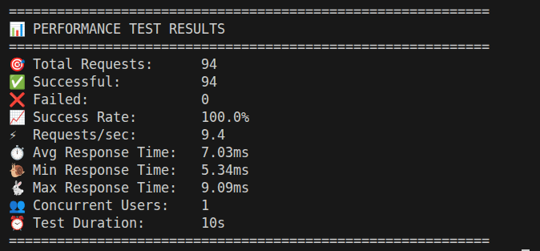
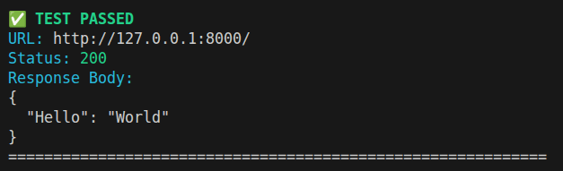
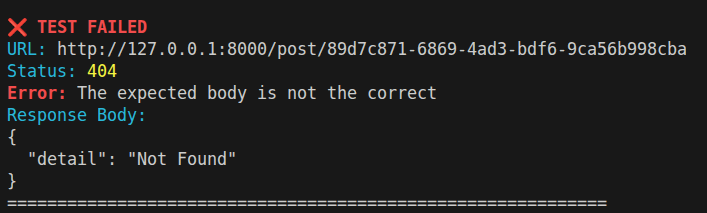

# RapidTest 🚀

A **super lightweight** and blazingly fast library to simplify REST API testing. Designed to be intuitive, fast to implement, and with clear colorized reports - **no heavy dependencies!**

## ✨ Features

- **Simplicity**: Perform HTTP requests (`GET`, `POST`, `PUT`, `PATCH`, `DELETE`) in a single line.
- **Automatic Validation**: Automatically compare status codes and response bodies.
- **Fast & Lightweight**: Minimal dependencies, maximum speed!
- **Colorized Reports**: Clean console output with ANSI colors to identify failures quickly.
- **Data Generator**: Integrated random data generator (using Faker) for dynamic testing.
- **Performance Testing**: Built-in load testing with threading - no external tools needed!

## 🛠️ Installation

Install the required dependencies:

```bash
pip install rapidtest
```

Or install dependencies manually:

```bash
pip install requests faker
```

## 🚀 Quick Start

### 1. Initialize RapidTest

```python
from rapidtest import Test

# Configure your API's base URL
tester = Test(url="http://localhost:8000")
```

### 2. Run Tests

#### GET
```python
tester.get(endpoint="/users", expected_status=200)
```

#### POST with Body Validation
```python
user_data = {"username": "hector", "password": "123"}
tester.post(endpoint="/user", json=user_data, expected_status=201, expected_body=user_data)
```

#### PUT / PATCH / DELETE
```python
# Update data
tester.put(endpoint="/user/hector", json={"password": "new_password"}, expected_status=200)

# Delete resource  
tester.delete(endpoint="/user/hector", expected_status=204)
```

### 3. Generate Random Data

Use the `Data` class to create test data on the fly:

```python
from rapidtest import Data

user = Data.generate_auth_user()
email = Data.generate_email()
name = Data.generate_name()
phone = Data.generate_phone()

print(user) # {'username': '...', 'password': '...'}
```

### Available Data Generation Methods

The `Data` class includes the following static methods:

#### User Data
- `generate_auth_user()` - Generates a dictionary with username and password
- `generate_name()` - Generates a random full name
- `generate_email()` - Generates a random email address
- `generate_password()` - Generates a secure random password
- `generate_phone()` - Generates a random phone number

#### Location Data
- `generate_address()` - Generates a random postal address
- `generate_city()` - Generates a random city name
- `generate_state()` - Generates a random state/province name
- `generate_zipcode()` - Generates a random postal code
- `generate_country()` - Generates a random country name

#### Other Data
- `generate_id()` - Generates a unique UUID
- `generate_job()` - Generates a random job title
- `generate_text()` - Generates random text (short paragraph)
- `generate_paragraph()` - Generates a long random paragraph
- `generate_date()` - Generates a random date (ISO format)
- `generate_datetime()` - Generates random date and time (ISO format)
- `generate_time()` - Generates a random time

### Additional Parameters

All HTTP methods support additional parameters:

```python
# Query parameters
tester.get(endpoint="/users", params={"page": 1, "limit": 10})

# Custom headers
tester.post(endpoint="/auth", json=user_data, headers={"Content-Type": "application/json"})

# Form data
tester.post(endpoint="/upload", data={"file": "content"})

# Additional requests arguments
tester.get(endpoint="/secure", timeout=30, verify=False)
```

## 🚀 Performance Testing

Use the `Performance` class to run simple load tests on your APIs:

```python
from rapidtest import Performance

# Initialize performance test
perf = Performance(
    base_url="http://localhost:8000",
    users=10,       # Number of concurrent users
    duration=30,    # Test duration in seconds  
    timeout=10      # Request timeout
)

# Add endpoint to test
perf.add_get_task(endpoint="/api/users")

# Run the test (results shown in terminal)
results = perf.run()

# Check results
print(f"Success rate: {results['success_rate']}%")
print(f"Average response time: {results['avg_response_time']}ms")
print(f"Requests per second: {results['requests_per_second']}")
```

### Simple Performance Testing Features

- **No external dependencies**: Uses only `requests` and `threading`
- **Real-time terminal output**: See results as they happen
- **Basic load simulation**: Multiple concurrent users
- **Essential metrics**: Response times, success rates, RPS
- **Python 3.12 compatible**: No Locust/gevent issues

### Performance Test Output

See real results in action:



```
🚀 Starting simple performance test
📍 URL: http://localhost:8000/api/users
👥 Users: 10
⏱️  Duration: 30s
--------------------------------------------------

============================================================
📊 PERFORMANCE TEST RESULTS  
============================================================
🎯 Total Requests:      1245
✅ Successful:          1245
❌ Failed:              0
📈 Success Rate:        100.0%
⚡ Requests/sec:        41.5
⏱️  Avg Response Time:   12.3ms
🐌 Min Response Time:   8.1ms
🐇 Max Response Time:   89.2ms
👥 Concurrent Users:    10
⏰ Test Duration:       30s
============================================================
🟢 Excellent performance!
```

## 📊 Reports

See how your tests look with real colorized output:

### ✅ Successful Test


### ❌ Failed Test


**Colors:**
- ✅ Green for PASSED tests
- ❌ Red for FAILED tests  
- 🔵 Blue for labels and info
- 🟡 Yellow for warnings

## 📁 Project Structure

- `rapidtest/`
  - `RapidTest.py`: Core library logic
  - `RapidData.py`: Random data generator
  - `Performance.py`: Simple performance testing (no external deps)
  - `Utils.py`: Formatting and reporting utilities
  - `__init__.py`: Module configuration

## 🔧 Dependencies

- `requests>=2.25.1`: For making HTTP requests
- `faker>=13.0.0`: For generating fake data

**That's it!** 🎉

✨ **Ultra lightweight** - removed Rich dependency for maximum speed  
🚀 **Fastest startup** - minimal imports, instant execution  
🧵 **Built-in performance testing** - uses only standard library `threading`

## 📋 Requirements

- Python >=3.7

## 📖 Project Information

- **Version**: 0.3.0
- **Author**: Hector Rosales
- **License**: MIT
- **Homepage**: https://github.com/hector-dev/rapidtest


---
⚡ **Built for speed and simplicity** - because testing should be fast and fun! 🛠️✨
